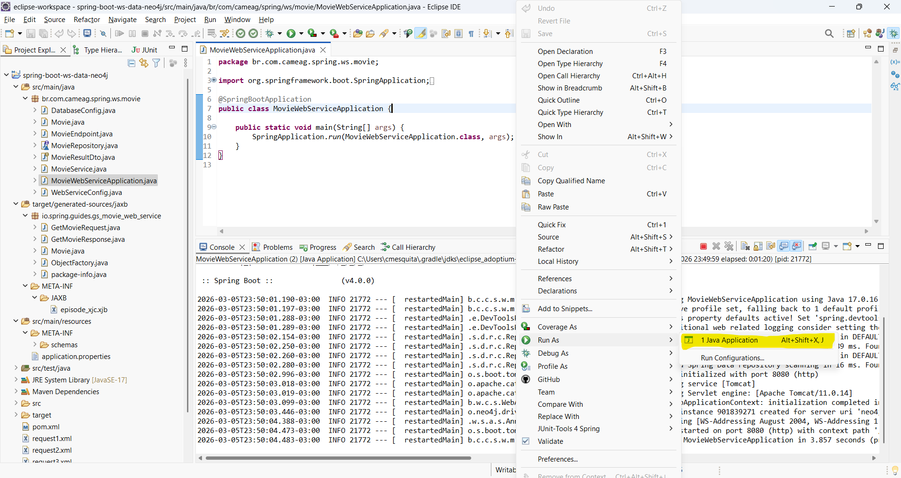
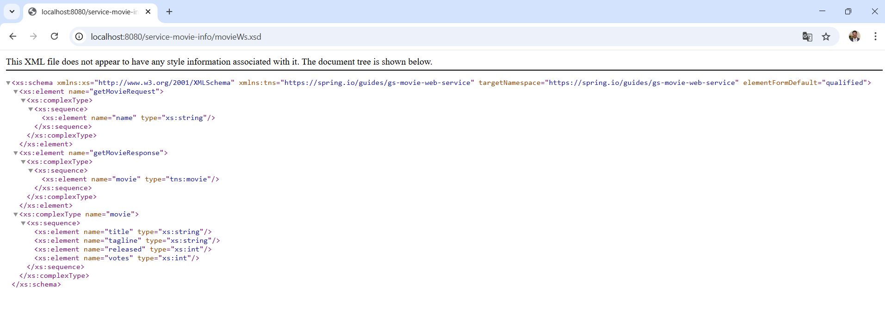
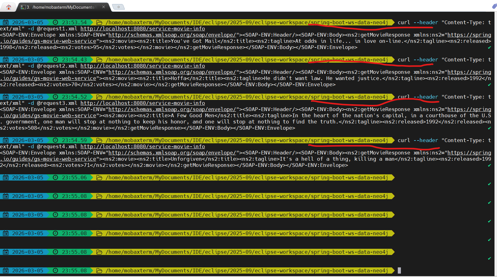
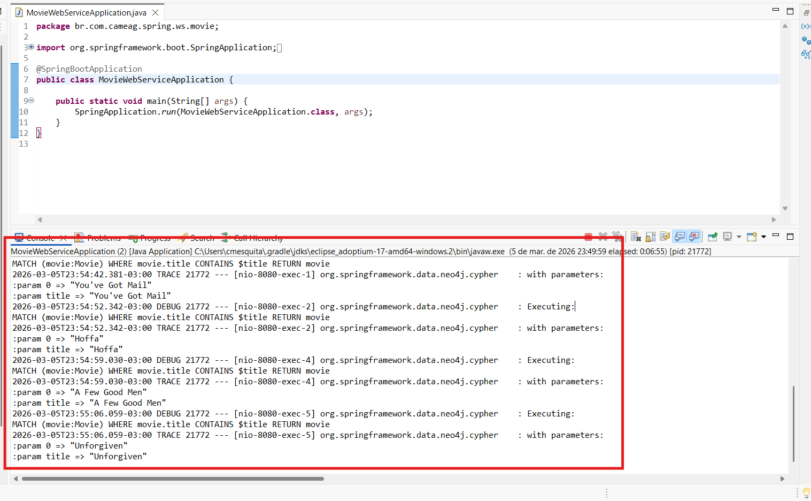

Spring Boot + Spring WS + Spring Data com Neo4j:

Abaixo segue imagem do resultado da execução:

A imagem a seguir se trata do contrato JAXB definido:

Agora temos a execução das requisições via curl. O resultado se trata do número de votos obtido por cada filme:

Por fim, temos o log de execução:

